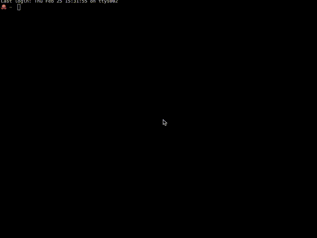

# My stars

Simple cli script to show you your n last stars on github. 

## Usage

There must be global GIT_HUB_USER variable set to your github username.

        Usage: my-latest-stars [options]

        Options:
          -h, --help   Show help
          -l, --limit  Limit of the stars to show, default is 10. 0 = no
                       limit.
          -u, --user   If you don't want to make global username variable, you can just
               pass in your github username as argument

        Made by DKunin http://dkunin.github.io/

## In use

## License
 
Licensed under the [MIT License](http://www.opensource.org/licenses/mit-license.php).
